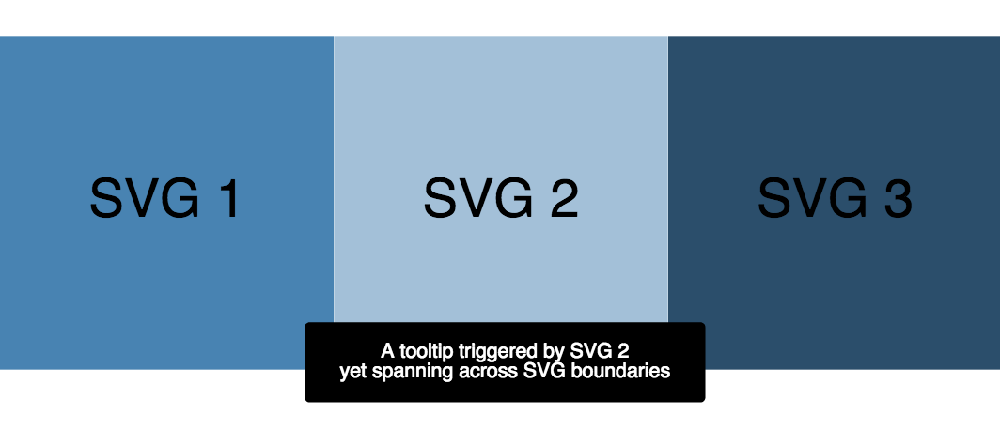

# React SVG Tooltip [](https://travis-ci.org/netzwerg/react-svg-tooltip) [](https://github.com/facebook/react/blob/master/LICENSE) [](https://www.npmjs.com/package/react-svg-tooltip)

A React component to create tooltips for SVG elements.

The library offers a `Tooltip` component which can be embedded into any SVG element hierarchy.
The component does not actually provide a tooltip.
Instead, it provides a 0-based coordinate system relative to the current mouse position, so you can place your favorite SVG elements in whichever style suits your needs.
Behind the scenes, the library handles all mouse listener logic and makes sure that your tooltip is always rendered on top of all other SVG elements (by using a [React portal](https://reactjs.org/docs/portals.html)).

You might want to read [this blog post](https://netzwerg.ch/blog/2018/05/24/react-svg-tooltips/) for further details.

## Installation

`npm install react-svg-tooltip`

Note that `react` and `react-dom` peer dependencies must already be installed in version `16.3.x` or above.

## Basic Usage

This example demonstrates how to attach a rectangular tooltip with some text to a circle shape.
The `triggerRef` property accepts a reference to an arbitrary element (a circle in our example), which further serves as the mouse trigger.
Note how the x/y-coordinates of the tooltip contents (`rect` and `text`) can be expressed relative to the mouse position. 

```jsx
import * as React from 'react';
import { Tooltip } from 'react-svg-tooltip';

const App = () => {

    const circleRef = React.createRef<SVGCircleElement>();

    return (
        <div className='App'>
            <svg viewBox='0 0 100 100'>
                <circle ref={circleRef} cx={50} cy={50} r={10} fill='steelblue'/>
                <Tooltip triggerRef={circleRef}>
                    <rect x={2} y={2} width={10} height={5} rx={.5} ry={.5} fill='black'/>
                    <text x={5} y={5} fontSize={2} fill='white'>Yay!</text>
                </Tooltip>
            </svg>
        </div>
    );
};

export default App;
```

[](https://codesandbox.io/s/4wjoopo1vx)


## Advanced Usage

By default, the tooltip is added to the SVG root element which parents the triggering element.
This can be limiting in certain scenarios, e.g. if a small SVG triggers a tooltip which is larger than its own SVG root.
It is therefore possible to add the tooltip to a *different* SVG root, making glass-pane-like usages possible.
The following example illustrates how 3 small SVG tiles can display tooltips on a shared SVG glass pane.
The wiring is achieved through the `containerRef` property.

```jsx
import * as React from "react";
import * as ReactDOM from "react-dom";
import { Tooltip } from "react-svg-tooltip";
import "./index.css";

const App = () => {
  const containerRef = React.createRef<SVGSVGElement>();

  const triggerRef1 = React.createRef<SVGSVGElement>();
  const triggerRef2 = React.createRef<SVGSVGElement>();
  const triggerRef3 = React.createRef<SVGSVGElement>();

  return (
    <div className="app">

      <svg ref={containerRef} className="glasspane" viewBox="0 0 100 100" />

      <svg ref={triggerRef1} className="tile" viewBox="0 0 100 100">
        <rect width="100%" height="100%" fill="steelblue" />
        <text x="50%" y="50%">
          SVG 1
        </text>
      </svg>

      <svg ref={triggerRef2} className="tile" viewBox="0 0 100 100">
        <rect width="100%" height="100%" fill="#a2c0d9" />
        <text x="50%" y="50%">
          SVG 2
        </text>
      </svg>

      <svg ref={triggerRef3} className="tile" viewBox="0 0 100 100">
        <rect width="100%" height="100%" fill="#2a4e6c" />
        <text x="50%" y="50%">
          SVG 3
        </text>
      </svg>

      <Tooltip triggerRef={triggerRef1} containerRef={containerRef}>
        <rect x={2} y={2} width={40} height={8} rx={0.5} ry={0.5} fill="black" />
        <text x={22} y={5} fontSize={2} fill="white">
          <tspan>A tooltip triggered by SVG 1</tspan>
          <tspan x={22} dy="1em">
            yet spanning across SVG boundaries
          </tspan>
        </text>
      </Tooltip>

      <Tooltip triggerRef={triggerRef2} containerRef={containerRef}>
        <rect x={-18} y={2} width={40} height={8} rx={0.5} ry={0.5} fill="black" />
        <text x={2} y={5} fontSize={2} fill="white">
          <tspan>A tooltip triggered by SVG 2</tspan>
          <tspan x={2} dy="1em">
            yet spanning across SVG boundaries
          </tspan>
        </text>
      </Tooltip>

      <Tooltip triggerRef={triggerRef3} containerRef={containerRef}>
        <rect x={-38} y={2} width={40} height={8} rx={0.5} ry={0.5} fill="black" />
        <text x={-18} y={5} fontSize={2} fill="white">
          <tspan>A tooltip triggered by SVG 3</tspan>
          <tspan x={-18} dy="1em">
            yet spanning across SVG boundaries
          </tspan>
        </text>
      </Tooltip>
    </div>
  );
};

ReactDOM.render(<App />, document.getElementById("root"));
```

[](https://codesandbox.io/s/w6vqpkv36l)



## Acknowledgements

Based on [typescript-library-starter-lite](https://github.com/tonysneed/typescript-library-starter-lite.git).

## License

Licensed under [MIT License](LICENSE).

&copy; Rahel Lüthy 2018
